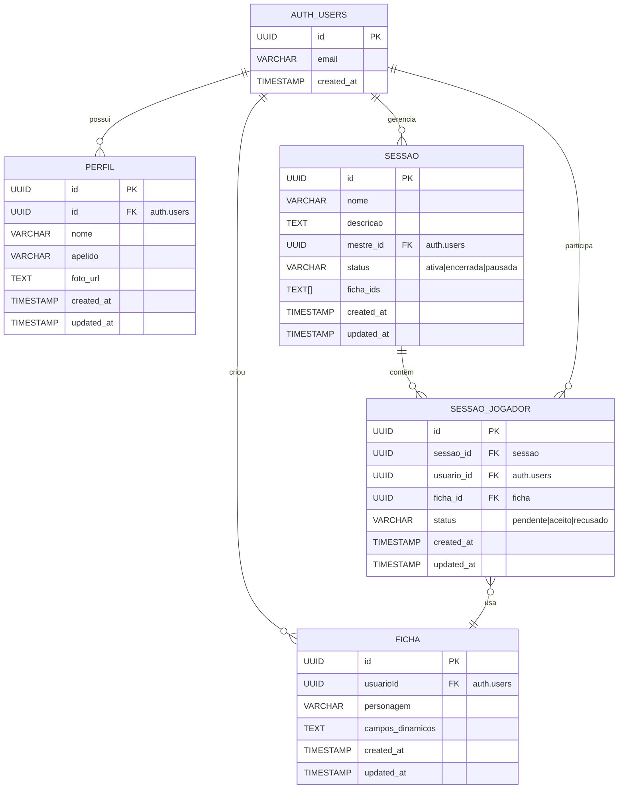

# GM.deck


GM.deck é um software online para gerenciamento de fichas de RPG de mesa. Ele permite que jogadores e mestres organizem fichas de personagens, gerenciem sessões e exportem PDFs, mantendo o controle das campanhas de forma centralizada e prática.

---

## Visão Geral

**Objetivo:**  
Permitir que jogadores e mestres de RPG de mesa organizem suas fichas de forma digital, evitando retrabalho, confusão e excesso de papéis. O sistema oferece edição em tempo real, controle de sessões, gerenciamento de jogadores e visualização interativa de PDFs.

**Público-alvo:**

- Jogadores iniciantes que buscam praticidade e autonomia.  
- Mestres veteranos que precisam gerenciar múltiplas campanhas simultaneamente.  
- Jogadores intermediários que atuam também como mestres ocasionais.

---

## Funcionalidades

- **Autenticação e Perfil:** Sistema de login/registro com email e senha, edição de perfil com foto de avatar.  
- **Gerenciamento de Fichas:** Criação, edição e exclusão de fichas de personagem com suporte a campos dinâmicos via PDF interativo.  
- **Visualização de PDFs:** Visualizador integrado usando PDF.js para edição direta de campos em fichas PDF.  
- **Gerenciamento de Sessões:** Criação de sessões de jogo, controle de status (ativa, encerrada, pausada), descrição e nome personalizados.  
- **Sistema de Jogadores:** Entrada nas sessões por id compartilhado, controle de status (pendente, aceito, recusado), seleção de fichas por sessão.  
- **Tempo Real:** Atualizações em tempo real usando Supabase Realtime para sincronização de dados entre usuários.  
- **Dashboard:** Interface centralizada para gerenciar fichas e sessões com visualização separada por abas e badges.  
- **Controle de Acesso:** Diferenciação entre mestre e jogador com permissões específicas para cada papel.

---

## Arquitetura de Software

- **Front-end:** Next.js 15.5.0 (React 19.1.0) com renderização híbrida (SSR e CSR), usando Turbopack para desenvolvimento.  
- **Estilização:** Tailwind CSS 4.1.14 com sistema de design customizado e componentes reutilizáveis.  
- **Linguagem:** TypeScript 5 para type safety em todo o projeto.  
- **Autenticação:** Supabase Auth com autenticação via email/senha.  
- **Banco de Dados:** Supabase PostgreSQL com as seguintes tabelas principais:
  - `sessao`: Gerencia sessões de jogo (nome, descrição, status, mestre_id, ficha_ids)
  - `sessao_jogador`: Relaciona jogadores com sessões (status, ficha_id)
  - `ficha`: Armazena fichas de personagem com campos dinâmicos
  - `perfil`: Perfis de usuário (nome, apelido, foto)
- **Storage:** Supabase Storage para armazenamento de fotos de perfil.  
- **Tempo Real:** Supabase Realtime para sincronização de dados em tempo real.  
- **Visualização de PDF:** PDF.js 5.4.394 para renderização e interação com fichas em formato PDF.  
- **Validação:** Zod 4.1.12 para validação de dados.  
- **Ícones:** Lucide React para interface visual.  
- **Infraestrutura:** Hospedagem na Vercel, Supabase para banco de dados, autenticação, storage e realtime.

### Diagrama do Banco de Dados (ER Mermaid)



---

## Tecnologias Utilizadas

### Dependências Principais

- **next**: ^15.5.0 - Framework React com SSR/SSG
- **react**: ^19.1.0 - Biblioteca UI
- **react-dom**: ^19.1.0 - Renderização React
- **@supabase/supabase-js**: ^2.56.0 - Cliente Supabase
- **pdfjs-dist**: ^5.4.394 - Visualizador de PDF
- **tailwind-merge**: ^3.4.0 - Merge de classes Tailwind
- **clsx**: ^2.1.1 - Utilitário para classes CSS
- **lucide-react**: ^0.544.0 - Biblioteca de ícones
- **zod**: ^4.1.12 - Validação de schemas

### Dependências de Desenvolvimento

- **typescript**: ^5 - Superset JavaScript com tipos
- **tailwindcss**: ^4.1.14 - Framework CSS utility-first
- **eslint**: ^9.39.1 - Linter JavaScript/TypeScript
- **prettier**: ^3.6.2 - Formatador de código
- **@types/node**: ^20 - Tipos TypeScript para Node.js
- **@types/react**: ^19 - Tipos TypeScript para React

---

## Estrutura do Projeto

```
gm-deck/
├── lib/
│   ├── supabaseClient.ts    # Cliente Supabase configurado
│   ├── useAuth.ts            # Hook de autenticação
│   └── storageUtils.ts       # Utilitários de storage
├── src/
│   ├── app/
│   │   ├── components/       # Componentes da aplicação
│   │   │   ├── Sidebar.tsx
│   │   │   ├── PdfFichaModal.tsx
│   │   │   ├── PdfJsViewer.tsx
│   │   │   ├── CriarSessaoModal.tsx
│   │   │   ├── EntrarSessaoModal.tsx
│   │   │   └── ...
│   │   ├── dashboard/         # Página principal
│   │   ├── login/            # Página de login
│   │   ├── register/         # Página de registro
│   │   └── session/[id]/      # Página de sessão dinâmica
│   ├── hooks/
│   │   ├── useSupabasePdf.ts      # Hook para gerenciar fichas
│   │   ├── useSupabaseSessao.ts   # Hook para gerenciar sessões
│   │   └── useSessaoRole.ts       # Hook para verificar roles
│   ├── components/ui/        # Componentes UI reutilizáveis
│   │   ├── Button/
│   │   ├── Card/
│   │   ├── Input/
│   │   ├── Toast/
│   │   └── ...
│   └── styles/
│       └── tokens.css        # Design tokens
└── public/
    └── pdf-js/               # Bibliotecas PDF.js
```

---

## Scripts Disponíveis

- `npm run dev` - Inicia servidor de desenvolvimento com Turbopack
- `npm run build` - Cria build de produção com Turbopack
- `npm run start` - Inicia servidor de produção
- `npm run lint` - Executa o linter
- `npm run lint:fix` - Executa o linter e corrige problemas automaticamente
- `npm run extract-coordinates` - Extrai coordenadas de campos PDF

---

## Configuração do Ambiente

1. Clone o repositório
2. Instale as dependências: `npm install`
3. Crie um arquivo `.env.local` com as seguintes variáveis:

```env
NEXT_PUBLIC_SUPABASE_URL=sua_url_do_supabase
NEXT_PUBLIC_SUPABASE_ANON_KEY=sua_chave_anonima_do_supabase
```

4. Execute `npm run dev` para iniciar o servidor de desenvolvimento

---

## Segurança

- Credenciais sensíveis são armazenadas em variáveis de ambiente
- Arquivos `.env*` estão no `.gitignore`
- Autenticação gerenciada pelo Supabase Auth
- Row Level Security (RLS) configurado no Supabase para controle de acesso
- Apenas a chave anônima (anon key) é exposta no cliente

---

## Licença

MIT

